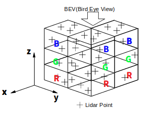
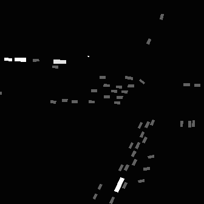

# kaggle-lyft-3d-object-detection-av
[](https://github.com/Fkaneko/kaggle-lyft-3d-object-detection-av/actions?query=workflow%3Alint)
[](https://pycqa.github.io/isort/)
[](https://github.com/psf/black)
<!-- [](https://www.deepcode.ai/app/gh/Fkaneko/kaggle-lyft-3d-object-detection-av/_/dashboard?utm_content=gh%2FFkaneko%2Fkaggle-lyft-3d-object-detection-av) -->

## Description
Training and Prediction code for Kaggle competition,
[Lyft 3D Object Detection for Autonomous Vehicles](https://www.kaggle.com/c/3d-object-detection-for-autonomous-vehicles).
The target is 3d object detection with the input of 3d lidar points.


This visualization is from https://www.kaggle.com/rishabhiitbhu/visualizing-predictions#3D-Interactive-visualization.
For more details about this dataset please refer to [the lyft page](https://github.com/lyft/nuscenes-devkit)

### Training scheme: 2d segmentation with BEV.
In this repo, [the baseline](https://www.kaggle.com/gzuidhof/reference-model) is re-implemented.
 At this baseline each 3d lidar scan is converted into simple BEV, Bird Eye View image, like below.



 Along z axis lidar 3d point space is split into 3 bins and each bin mapped into channel axis of normal 2d image.
 x-y plane gird become pixel for BEV image, left figure below.
 The target 3d bounding box is also cast into BEV as 2d mask, right figure below, and training is conducted as 2d segmentation.
 After the training 2d predicted mask will cast back to 3d bounding box.




## How to run
First, download the data, [here](https://www.kaggle.com/c/lyft-motion-prediction-autonomous-vehicles/data),
You will get the followings.
```bash
/your/dataset/root_path
    │
    ├ train.csv
    ├ sample_submission.csv
    ├ test_data/
    ├ test_images/
    ├ test_maps/
    ├ test_lidar/
    ├ train_data/
    ├ train_images/
    ├ train_maps/
    └ train_lidar/
```

Install dependencies,
```bash
# clone project
git clone https://github.com/Fkaneko/kaggle-lyft-3d-object-detection-av

# install project
cd kaggle-lyft-3d-object-detection-av
pip install -r requirements.txt
 ```
 Run training and testing it,
 ```bash
# generate BEV images from lidar points
python make_bev_image.py \
            --dataset_root_dir \
           /your/dataset/root_path \
            --image_size \
            336 \
            --voxel_size_xy \
            0.2
# run training, --bev_data_dir is a directory generated by make_bev_image.py
python run_bev_det.py \
            --bev_data_dir \
            ./BEV/version_xx \
           --epochs \
           50 \
           --lr \
           1.0e-3 \
           --batch_size \
           96 \
           --num_workers \
           4
# run test
python run_bev_det.py \
            --bev_data_dir \
            ./BEV/version_xx \
           --is_test \
           --ckpt_path \
           /your/trained/ckeckpoint_path \
           --batch_size \
           96 \
           --num_workers \
           4
```
After testing you will find ``/your/trained/checkpoint_path_dir/submission.csv``, and you can check the test score
thorough [this submission page](https://www.kaggle.com/c/3d-object-detection-for-autonomous-vehicles/submit)

## Competition summary
There is [a summary](https://www.kaggle.com/c/3d-object-detection-for-autonomous-vehicles/discussion/133895) by the competition host.
<!-- [The baseline CNN regression approach](https://www.kaggle.com/lucabergamini/lyft-baseline-09-02),
just replacing the 1st and final layers of Imagenet pretrained model, was strong.
Segmentaion or RNN approeches are not good.  And following tips we can get
top-10 equivalent performance(11.238) using the baseline approach.

* [Directly optimize evaluation metric](https://www.kaggle.com/corochann/lyft-training-with-multi-mode-confidence).
The target metric ["multi-modal negative log-likelihood loss"](https://github.com/lyft/l5kit/blob/master/competition.md).
is differential.

* [Use the same filtering configuration as test data is generated](https://www.kaggle.com/c/lyft-motion-prediction-autonomous-vehicles/discussion/199657), it means
    `MIN_FRAME_HISTORY = 0` and `MIN_FRAME_FUTURE = 10` at
    [`l5kit.dataset.AgentDataset`](https://github.com/lyft/l5kit/blob/082359ae88a53326e6693568760815597e364054/l5kit/l5kit/dataset/agent.py#L20).

* Use all train data, in total 198474478 agents. It's really huge but
the loss continuously decrease during training.

Actually I got the following result. The history_frames was 10 at the baseline so if you can use 10 instead of 2
you may get better result than top-10 score, 11.283 with this single model.
You can check [11.377 result with my full test pipeline and trained weight at kaggle notebook](https://www.kaggle.com/sai11fkaneko/lyft-late-submission-study).


| model      | backbone    | scenes | iteration x batch_size | loss        | history\_frames                  | MIN_FRAME_HISTORY / FUTURE | test score |
| -          | -           | -      | -                      | -           | -                                | -                          | -          |
| baseline   | resnet50    | 11314  | 100k x 64              | single mode | 10                               | 10/1                       | 104.195    |
| this study | seresnext26 | 134622 | 451k x 440             | multi-modal | 2 (10->2 due to time constraint) | 0/10                       | 11.377     |

**[Note]** The backbone difference is not a matter, within top-10 solution a single resnet18 reaches score < 10.0.
But smaller model tends to be better for this task. -->

### Results

| model      | backbone    | x-y grid size | x-y range |  test score |
| -          | -           | -      | -    | -        | -  |
| baseline   | effb1    | 0.4m x 0.4m  | [-67.2mm, 67.2mm] |  0.032|
| baseline   | effb2    | 0.4m x 0.4m  | [-67.2mm, 67.2mm] |  0.033|
| baseline   | ResNeSt50    | 0.4m x 0.4m  | [-67.2mm, 67.2mm] |  0.036|

### Prediction Visualization

Prediction visualization with this baseline re-implementation model, test score(mAP)=0.032.
The orange line is ground truth and green line is prediction.
This model uses really simple 2d segmentation but the model roughly handles
the 3d detection.


## License
#### Code
Attribution-NonCommercial 4.0 International (CC BY-NC 4.0)

#### Dataset
Please check, https://self-driving.lyft.com/level5/perception/

## Reference
* [Nine simple steps for better-looking python code](https://towardsdatascience.com/nine-simple-steps-for-better-looking-python-code-87e5d9d3b1cf).
* For the dataset, [lyft_dataset_sdk](https://github.com/lyft/nuscenes-devkit)
* Leaderboard, [kaggle competition page](https://www.kaggle.com/c/3d-object-detection-for-autonomous-vehicles/leaderboard)
